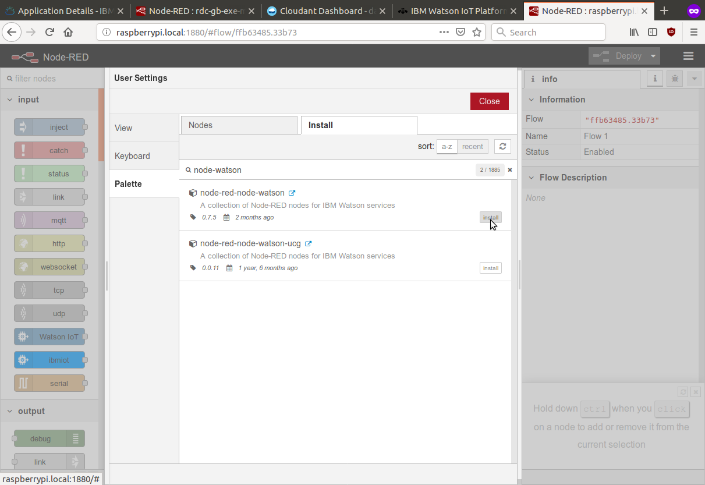
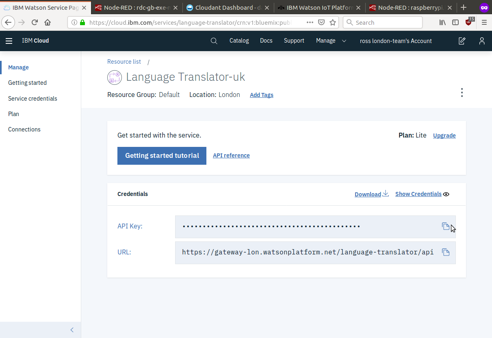
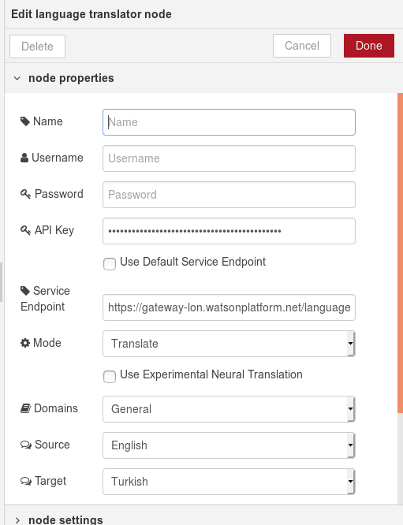

<!-- #################################################### -->
# Watson Cognitive from Raspberry Pi
<!-- #################################################### -->

Like the cloud-based NodeRED application, NodeRED on the Raspberry Pi can exploit the Watson Cognitive services; all that is needed is to install the `node-red-node-watson` module

## iot exe pi nodered install watson
Using the "Manage palette" option to install the required Watson node

 

## iot exe bmx translate key
Grab the API *and* the Service Endpoint URL from the Translate service in your IBM Cloud dashboard.
 

## iot exe pi nodered translate settings host
In a Language translation node in NodeRED on the Raspberry Pi, update the API Key field, and the Service Endpoint.  

*NOTE*: remember to set your desired source and target languages.

 

## iot exe pi nodered translate test

Generate a test message and try the Translate service (this example uses "Help - I'm trapped inside a pie")

 
