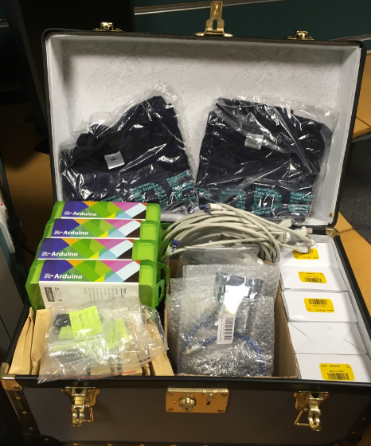
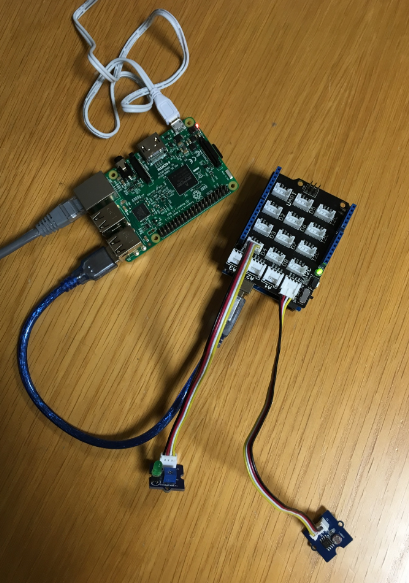

[Raspberry PI docs for NodeRED](https://nodered.org/docs/hardware/raspberrypi)

<!-- #################################################### -->
# IOT kit #
<!-- #################################################### -->

## the battle box ##

## the user kit ##

[Set up IOT capability in the IBM Cloud](Cloud-IOT.md)

[Set up IOT capability on the Raspberry Pi](Raspberry-IOT.md)

[Invoke your Watson services from Raspberry Pi](NodeRED-Watson.md)
