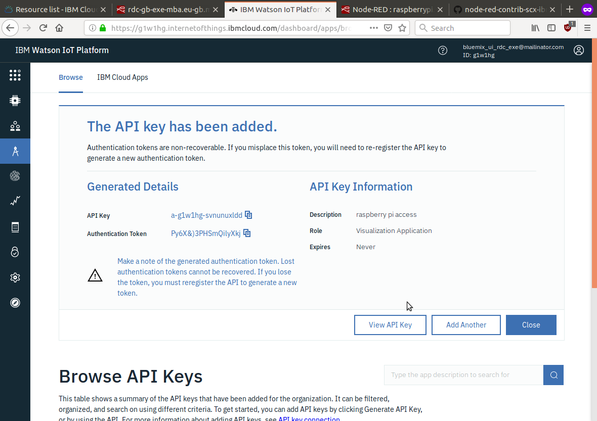
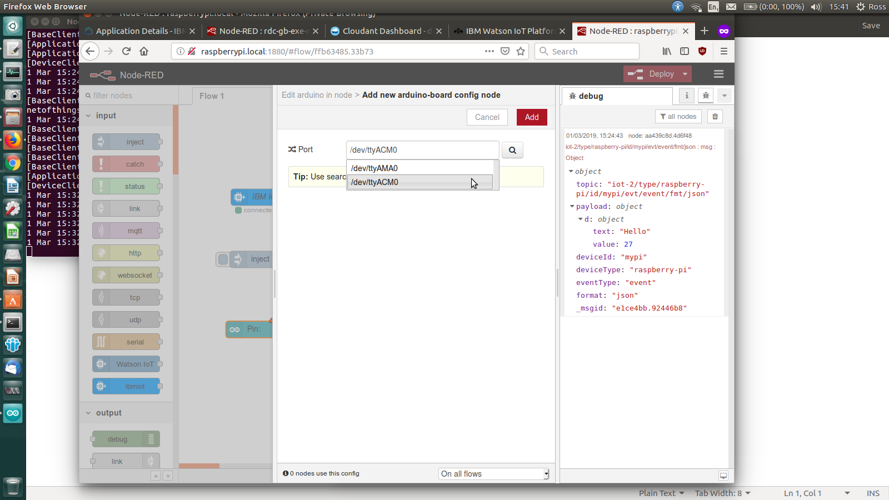

<!-- #################################################### -->
# Raspberry Pi setup #
<!-- #################################################### -->

## iot exe pi ssh
Login to your (named) Pi - replace "raspberrypi" with the name of device
you're associated with (TETHYS.local, for example).

The password for the * pi * user is set to the default (* raspberry *)

 

## iot exe pi ssh login
After login, you can change the password if you like

 

## iot exe pi nodered install
NodeRED has been installed on your Pi, consistent with
instructions from the [NodeRED site](https://nodered.org/docs/hardware/raspberrypi)
 

## iot exe pi nodered install cmd
 

## iot exe pi nodered install progress
The NodeRED install will
+ remove previous version(s)
+ install the current long time support version of Node.js
+ install Node Package Manager (npm)
+ install NodeRED
+ set up NodeRED in the local user context

 

## iot exe pi nodered install done
Once installation is complete, launching NodeRED is easy with the
`node-red-start` command

 

## iot exe pi nodered started
running the command interactively, means that you will see the console and error
logs for the application

 

## iot exe pi nodered ide
After NodeRED starts, you can connect to it via a browser using
`https://<your pi name>.local:1880/`

 

## iot exe pi nodered install scxiot
To be able to readily generate and consume IOT events with the IBM IOT Platform,
install the `node-red-contrib-scx-ibmiotapp` module - this has more flexibility
than the `Watson IOT` module installed by default.

 

## iot exe pi nodered iot in
Set up a subscriber node to listen for events in your IOT instance

 

## iot exe pi nodered iot out
Configure a publisher node to be able to send IOT events

 

## iot exe pi nodered iot testdata
Create some test data (in standard format for devices), and publish

 

## iot exe pi nodered iot testdata json
 

## iot exe view iot keys
To configure the IOT nodes to connect to the IBM Cloud IOT Platform instance, you will need a security key -- return to the IOT Platform Console and create an API key

 

## iot exe add iot api key
 

## iot exe add iot api key done
 

## iot exe add iot api key list
*NOTE*: you need to copy the key information shown here to a notepad or file, so you can add it to the NodeRED configuration on the Raspberry Pi

 

## iot exe add iot api key view
 

## iot exe pi nodered iot api key
Add the API Key name and the API token (which you saved from the Cloud IOT Platform, earlier)

 

## iot exe pi nodered iot out config
 

## iot exe pi nodered iot in config
 

## iot exe sec iot dev tls
For your Raspberry Pi to be able to connect reliably to IBM Cloud IOT Platform, you should modify the network security settings to make TLS optional.

 

## iot exe sec iot dev optional
 

## iot exe sec iot dev tls warn
 

## iot exe pi nodered iot publish
Now you're ready to publish messages using the IOT service
 

## iot exe pi nodered iot out set
 

## iot exe pi nodered iot in set
 

## iot exe pi nodered iot first msg
 

## iot exe bmx nodered nostart error
 

## iot exe pi nodered install arduino
 

## iot exe pi nodered arduino in
 

## iot exe pi arduino sketch firmata
 

## iot exe pi arduino sketch upload
 

## iot exe pi arduino port
 

## iot exe pi nodered arduino port
 

## iot exe pi nodered arduino in lux
 

## iot exe pi nodered arduino in lux data
 

## iot exe pi nodered arduino in rate
 

## iot exe pi nodered arduino in rate set
 

## iot exe pi nodered arduino iot msgs
 

## iot exe pi nodered arduino in lux format
 

## iot exe events iot list
 

## iot exe pi nodered arduino out set
 

## iot exe bmx iot in creds
 

## iot exe bmx iot in settings
 

## iot exe bmx iot in msgs
 

## iot exe bmx iot out data
 

## iot exe bmx iot out settings command
 

## iot exe bmx iot out data test
 

## iot exe pi nodered iot in command
 

## iot exe pi nodered iot in command format 1
 

## iot exe pi nodered iot save db
 

## iot exe pi nodered iot in commands
 

## iot exe pi nodered iot view db
 
